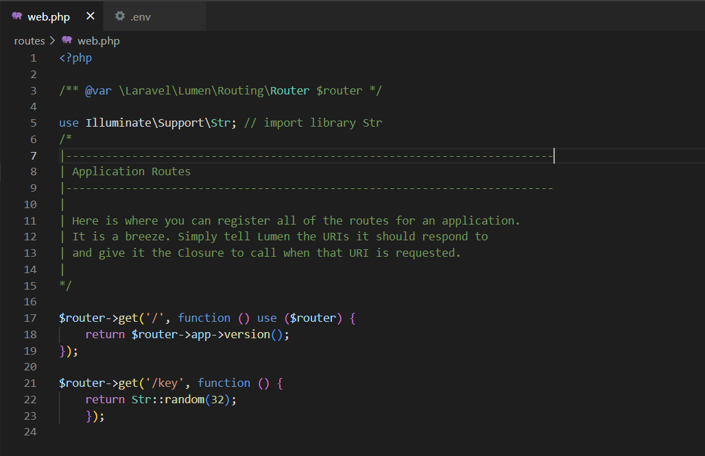

# Instalasi Lumen, MongoDB, dan Konfigurasi APP Key

* ## Percobaan Instalasi Composer
  Instalasi composer bisa dilakukan dengan cara membuka halaman https://getcomposer.org/download/ dan menjalankan Composer-Setup.exe. Namun dalam percobaan ini, composer telah terinstall sehingga langkah ini dilewati.  
  
  
* ## Percobaan Instalasi MongoDB
  Instalasi MongoDB dilakukan dengan cara mendownload MongoDB pada halaman https://www.mongodb.com/try/download/community. Setelah itu, jalankan file mongodb-windows-x86_64-7.0.1-signed.msi dan ikuti langkah-langkah berikut:  
  a. Klik "Next" pada halaman welcome  
       
  b. Centang "I accept the terms in the License Agreement" dan klik "Next"  
       
  c. Pilih opsi "Complete" pada bagian Choose Setup Type  
       
  d. Klik "Next" pada Service Configuration tanpa mengubah apapun  
       
  e. Pastikan "Install MongoDB Compass" tercentang  
       
  f. Klik "Install"  
       
  g. Tunggu hingga tahap instalasi selesai  
       
  h. MongoDB Compass akan terbuka secara otomatis  
       
       
     
* ## Percobaan Instalasi Lumen
  Pada percobaan ini, Instalasi Lumen dilakukan menggunakan tools Visual Studio Code dengan cara berikut:
  a. Buka folder yang telah dibuat pada Visual Studio Code  
  b. Buka file web.php pada direktori routes dan buat endpoint baru dengan kode sebagai berikut  
  > $router->get('/key', function () {
    return Str::random(32);
    });  
  >
      
  c. Jalankan server dengan perintah  
  > php -S localhost:8000 -t public  
  >
      
  d. Buka browser dan jalankan "localhost:8000" untuk mengecek apakah lumen telah terinstall  
  e. Untuk mendapat app key buka browser dan jalankan "localhost:8000/key"  
      
  f. Copy app key yang didapat pada file .env pada projek lumenapi  
      

