# Basic Routing dan Migration

* ## GET
  Tambahkan baris berikut untuk membuat endpoint method GET pada file **web.php** pada folder routes. <br><br>
  ```
    ...
    $router->get('/get', function () {
      return 'GET';
    });
  ```
  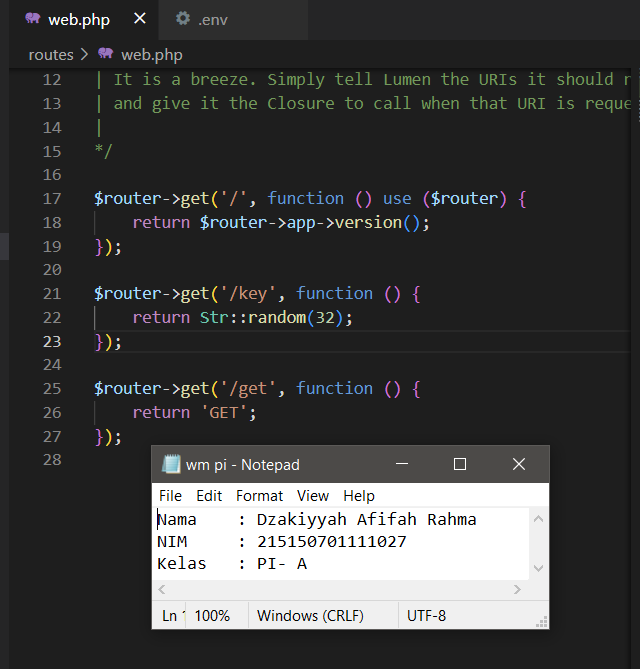 <br>
  Jalankan aplikasi dengan command di bawah pada terminal<br><br>
  ```
    php -S localhost:8000 -t public
  ```
  > [!NOTE]
  > Pastikan untuk membuka cmd atau terminal pada folder aplikasi

  Setelah aplikasi berhasil dijalankan, buka browser dengan url ```http://localhost:8000/get``` dan browser akan menghasilkan tampilan seperti berikut<br><br>
  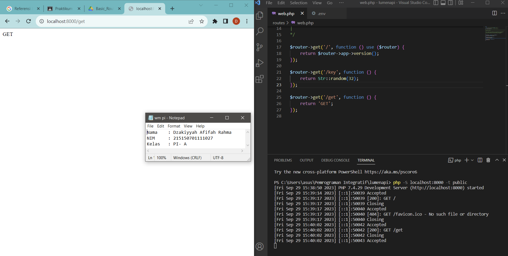 <br>
  
* ## POST, PUT, PATCH, DELETE, dan OPTIONS
  Tambahan method POST, PUT, PATCH, DELETE, dan OPTIONS pada file **web.php** dengan kode berikut<br><br>
  ```
    ...
    $router->post('/post', function () {
      return 'POST';
    });
  
    $router->put('/put', function () {
      return 'PUT';
    });
  
    $router->patch('/patch', function () {
      return 'PATCH';
    });
  
    $router->delete('/delete', function () {
      return 'DELETE';
    });
  
    $router->options('/options', function () {
    return 'OPTIONS';
    });
  ```
  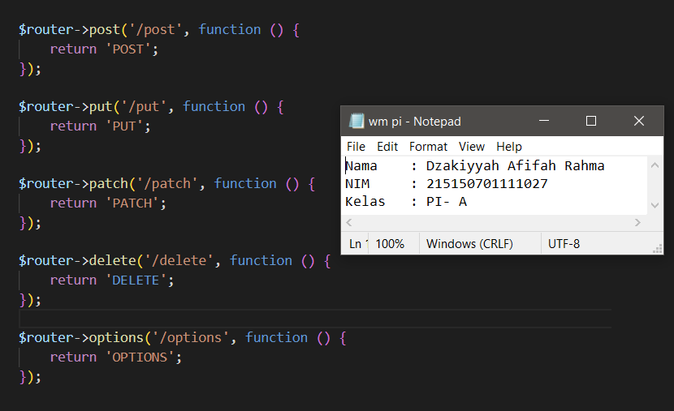 <br>
  
  Jalankan kembali server seperti pada saat percobaan GET. Pada percobaan ini, request ke server akan dilakukan menggunakan extensions pada VSCode yaitu **_Thunder Client_** <br>
  a. Install ekstensi **Thunder Client** <br><br>
  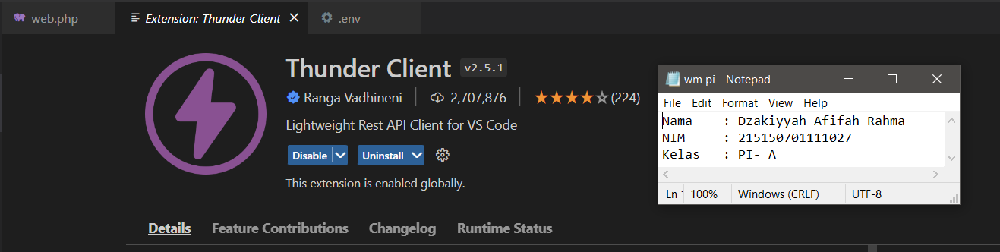 <br><br>
  b. Buat **New Request** pada ekstensi <br><br>
  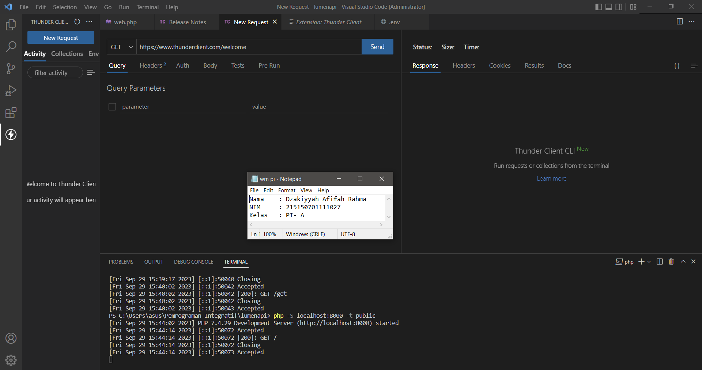 <br><br>
  c. Masukkan method dan url yang dituju <br><br>
  d. Akses url yang baru ditambahkan pada aplikasi dengan methodnya <br>
  ### Method post
  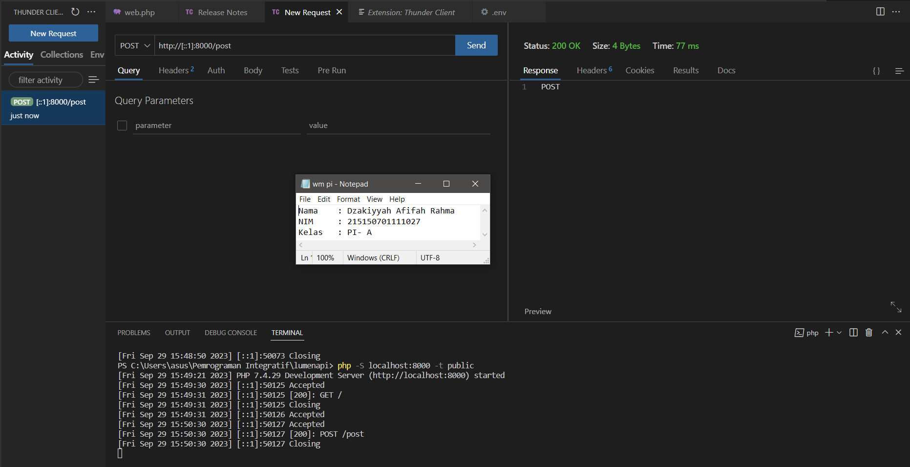 <br><br>
  ### Method put
  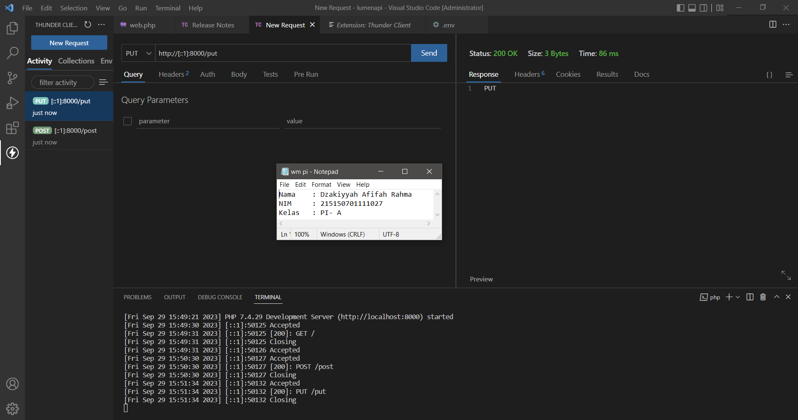 <br><br>
  ### Method patch
  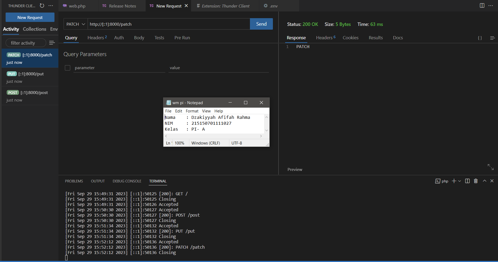 <br><br>
  ### Method delete
  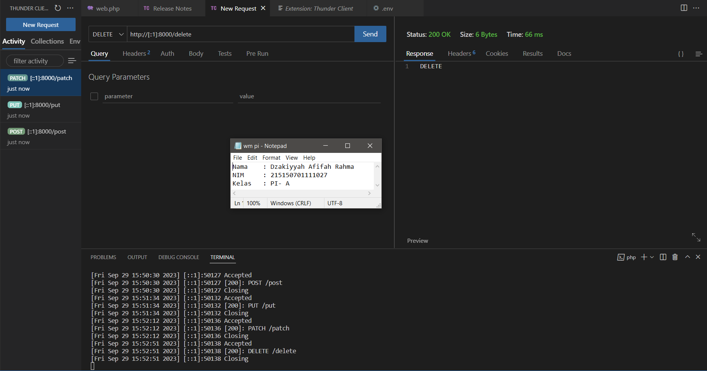 <br><br>
  ### Method options
   <br><br>
  
* ## Migrasi Database
  a. Pastikan server database aktif dan buat database dengan nama ```lumenapi``` sebelum melakukan migrasi database <br><br>
  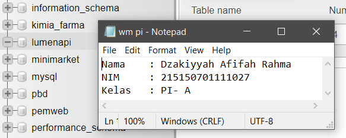 <br><br>
  b. Ubah konfigurasi database pada file **.env** menjadi seperti ini <br><br>
  ```
    DB_CONNECTION=mysql
    DB_HOST=127.0.0.1
    DB_PORT=3306
    DB_DATABASE=lumenapi
    DB_USERNAME=root
    DB_PASSWORD=<<password masing-masing>>
  ```
  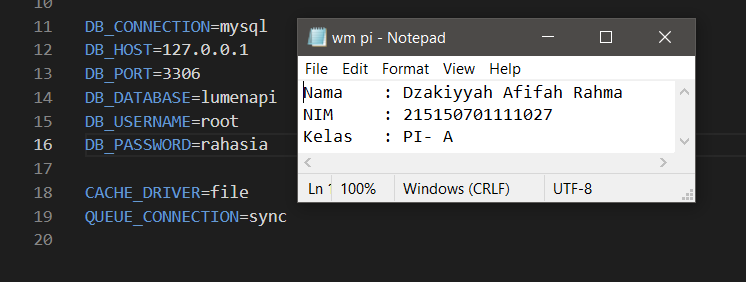 <br><br>
  c. Hidupkan library bawaan dari lumen dengan membuka file **app.php** pada folder bootstrap dengan menghilangkan tanda miring (//). Sehingga kode menjadi seperti ini <br><br>
  ```
    $app->withFacades();
    $app->withEloquent();
  ```
  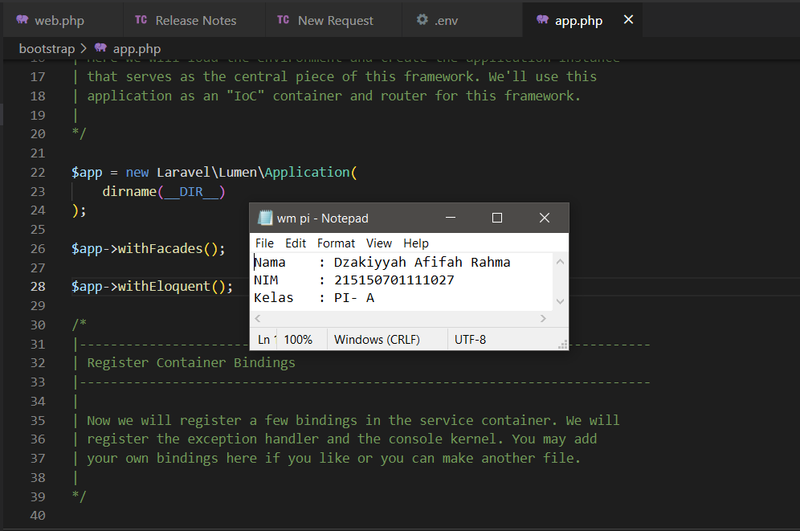 <br><br>
  d. Buat file migration dengan menjalankan command <br><br>
  ```
    php artisan make:migration create_users_table # membuat migrasi untuk tabel users
    php artisan make:migration create_products_table # membuat migrasi untuk tabel products
  ```
  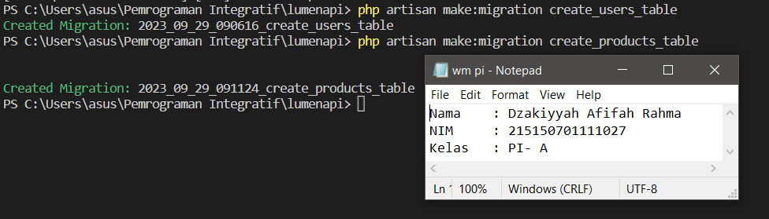 <br><br>
  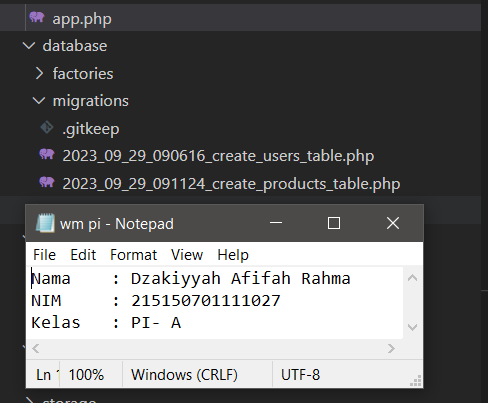 <br><br>
  > [!NOTE]
  > Ketika command berhasil dijalankan maka akan terbuat 2 file pada folder ```database/migrations``` dengan YYYY_MM_DD_HHmmss_nama_migrasi
  
  e. Ubah fungsi up pada file migrasi ```create_users_table```<br><br>
  ```
    ...
    public function up()
    {
      Schema::create('users', function (Blueprint $table) {
        $table->id();
        $table->timestamps();
        $table->string('name');
        $table->string('email');
        $table->string('password');
      });
    }
    ...
  ```
  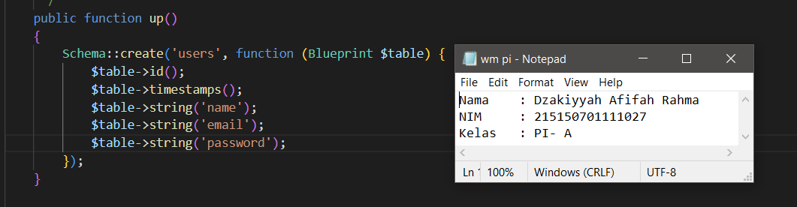 <br><br>
  f. Ubah fungsi up pada file migrasi ```create_products_table```<br><br>
  ```
    ...
    public function up()
    {
      Schema::create('products', function (Blueprint $table) {
        $table->id();
        $table->timestamps();
        $table->string('name');
        $table->integer('category_id');
        $table->string('slug');
        $table->integer('price');
        $table->integer('weight');
        $table->text('description');
      });
    }
    ...
  ```
  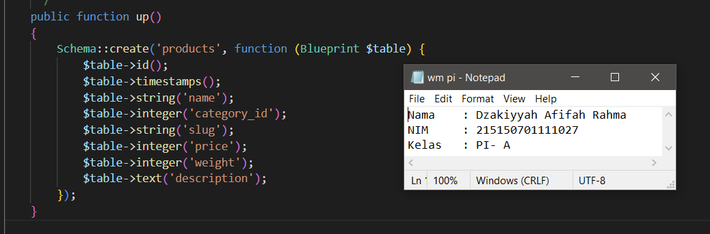 <br><br>
  g. Jalankan command <br><br>
  ```
    php artisan migrate
  ```
  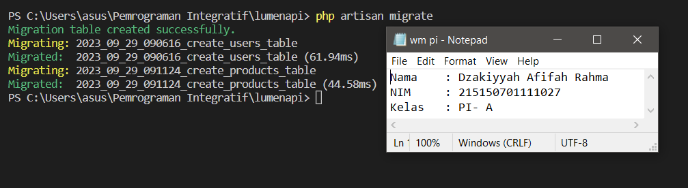 <br><br>
  h. Cek database **lumenapi** yang seharusnya berisi 2 tabel, yaitu tabel users dan tabel products <br><br>
  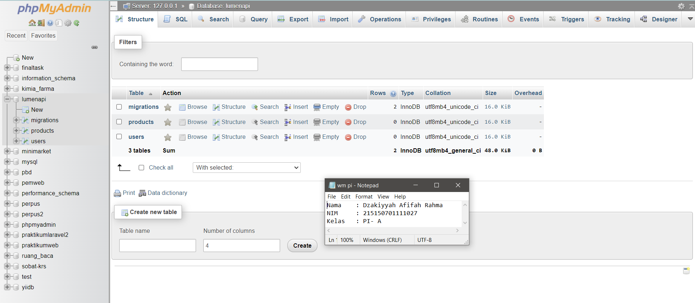 <br><br>

