# Relasi One-to-Many dan Many-to-Many

* ## Pembuatan Tabel
  Tabel yang digunakan adalah sebagai berikut<br>

  posts | comments | tags | post_tag |
  --- | --- | --- | --- |
  id | id | id | postId |
  content (STRING) | review (STRING) | name | tagId |

  <tb>1. Pastikan server database aktif kemudian pastikan sudah membuat database dengan nama ```lumenpost```<br>
  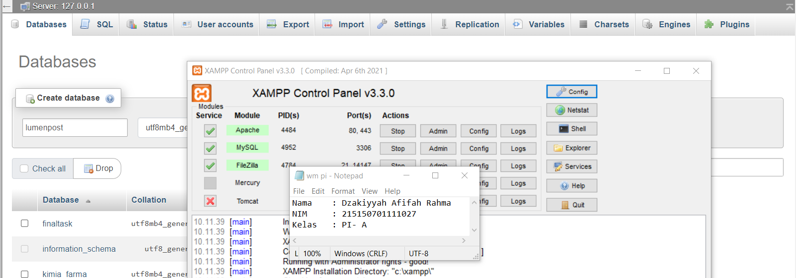 <br>
  
  <tb>2. Ubah konfigurasi database pada file ```.env``` menjadi<br>
  ```
    DB_CONNECTION=mysql
    DB_HOST=127.0.0.1
    DB_PORT=3306
    DB_DATABASE=lumenpost
    DB_USERNAME=root
    DB_PASSWORD=
  ```
  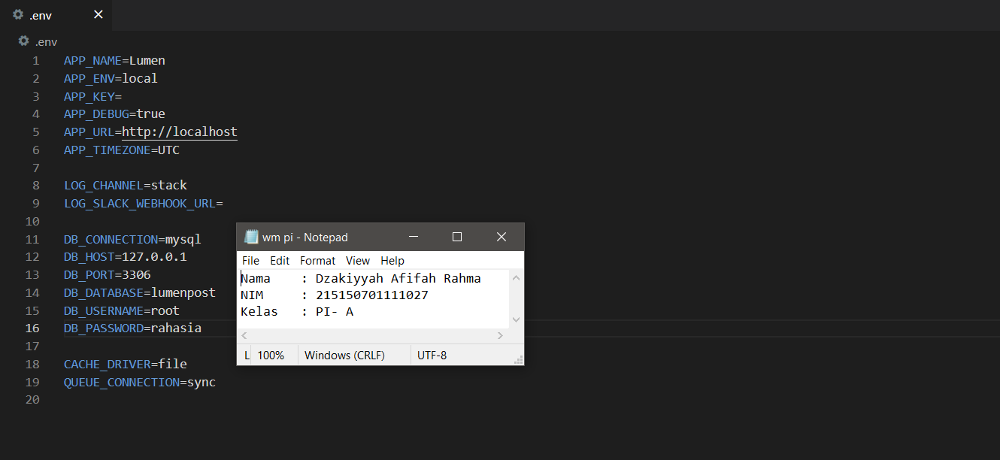 <br>
  
  <tb>3. Hidupkan beberapa library bawaan dari lumen dengan membuka file ```app.php``` pada folder ```bootstrap``` dan mengubah baris berikut<br>
  ```
    // $app->withFacades();
    // $app->withEloquent();
  ```
  menjadi
  ```
    $app->withFacades();
    $app->withEloquent();
  ```
  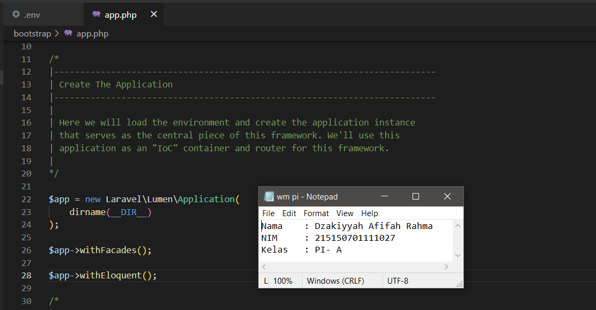 <br>
  
  <tb>4. Buat file ```migration``` dengan menjalankan command berikut<br>
  ```
    php artisan make:migration create_posts_table
    php artisan make:migration create_comments_table
    php artisan make:migration create_tags_table
    php artisan make:migration create_post_tag_table
  ```
  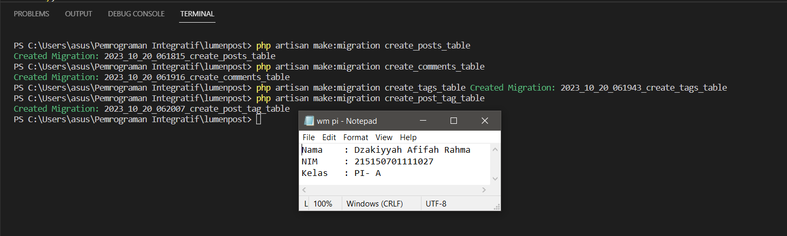 <br>
  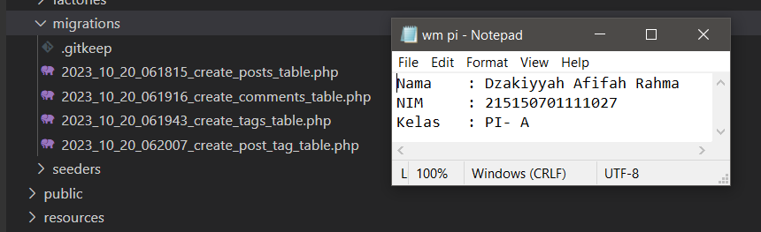 <br>
  
  <tb>5. Ubah fungsi ```up()``` pada file ```migrasi create_posts_table```<br>
  ```
    #sebelumnya
    ...
    public function up()
    {
      Schema::create('posts', function (Blueprint $table) {
        $table->id();
        $table->timestamps();
      });
    }
    ...

    #diubah menjadi
    ...
    public function up()
    {
      Schema::create('posts', function (Blueprint $table) {
        $table->id();
        $table->timestamps();
        $table->string('content');
      });
    }
    ...
  ```
  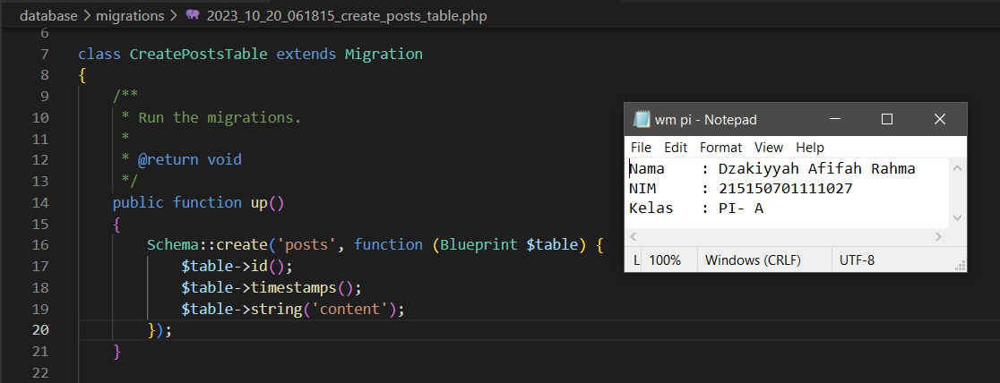 <br>
  
  <tb>6. Ubah fungsi ```up()``` pada file ```create_comments_table```<br>
  ```
    #sebelumnya
    ...
    public function up()
    {
      Schema::create('comments', function (Blueprint $table) {
        $table->id();
        $table->timestamps();
      });
    }
    ...
  
    #diubah menjadi
    ...
    public function up()
    {
      Schema::create('comments', function (Blueprint $table) {
        $table->id();
        $table->timestamps();
        $table->string('review');
        $table->foreignId('postId')->unsigned();
      });
    }
    ... 
  ```
  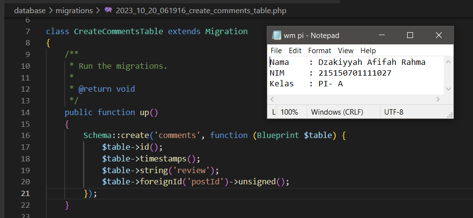 <br>
  
  <tb>7. Ubah fungsi ```up()``` pada file ```create_tags_table```<br>
  ```
    #sebelumnya
    ...
    public function up()
    {
      Schema::create('tags', function (Blueprint $table) {
        $table->id();
        $table->timestamps();
      });
    }

    #diubah menjadi
    ...
    public function up()
    {
      Schema::create('tags', function (Blueprint $table) {
        $table->id();
        $table->timestamps();
        $table->string('name');
      });
    }
    ...
  ```
  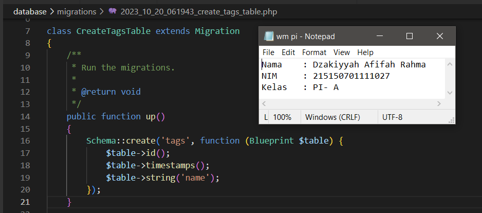 <br>
  
  <tb>8. Ubah fungsi ```up()``` pada file ```create_post_tag_table```<br>
  ```
    #sebelumnya
    ...
    public function up()
    {
      Schema::create('post_tag', function (Blueprint $table) {
        $table->id();
        $table->timestamps();
      });
    }
    ...
  
    #diubah menjadi
    ...
    public function up()
    {
      Schema::create('post_tag', function (Blueprint $table) {
        $table->id();
        $table->timestamps();
        $table->foreignId('postId')->unsigned();
        $table->foreignId('tagId')->unsigned();
      });
    }
    ...
  ```
  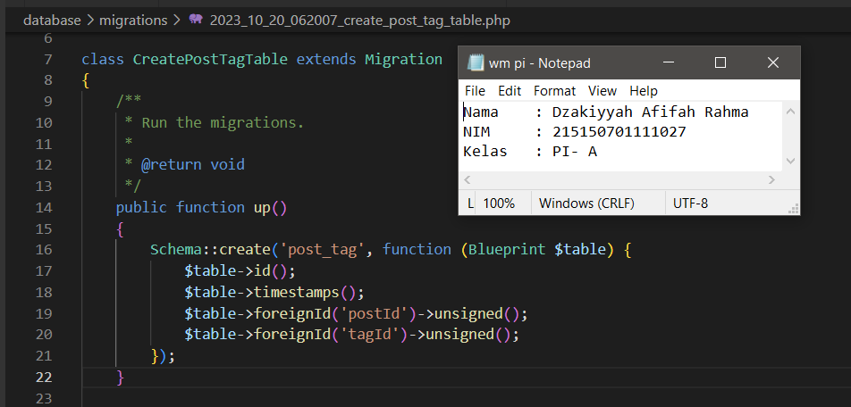 <br>
  
  <tb>9. Jalankan command berikut<br>
  ```
    php artisan migrate
  ```
  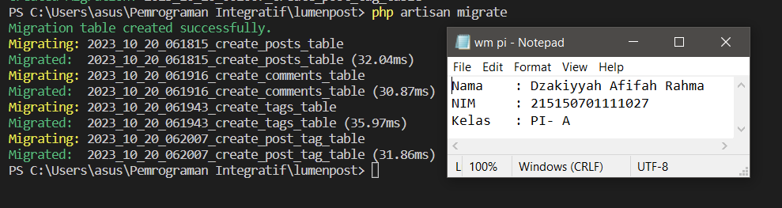 <br>
  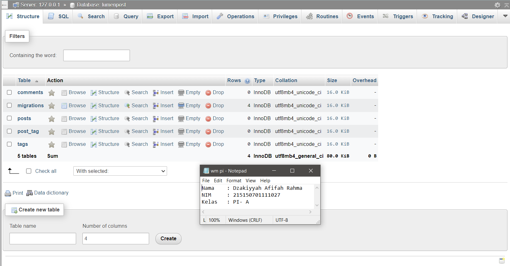 <br>
  
* ## Pembuatan Model
  <tb>1. Buatlah file dengan nama ```Post.php``` dan isi dengan baris kode berikut<br>
  ```
    <?php
    namespace App\Models;
  
    use Illuminate\Database\Eloquent\Model;
  
    class Post extends Model
    {
      /**
      * The attributes that are mass assignable.
      *
      * @var string[]
      */
      protected $fillable = [
        'content'
      ];
  
      /**
      * The attributes excluded from the model's JSON form.
      *
      * @var string[]
      */
      protected $hidden = [];
    }
  ```
  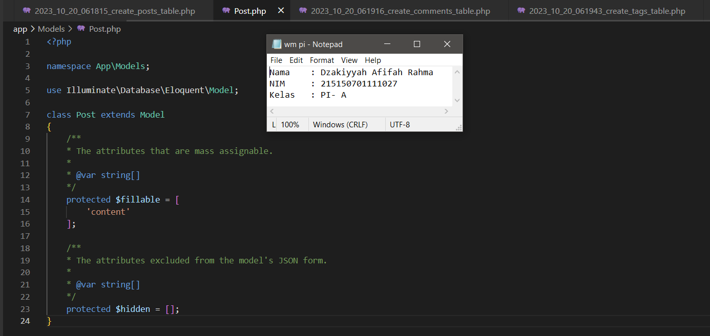 <br>
  
  <tb>2. Buatlah file dengan nama ```Comment.php``` dan isi dengan baris kode berikut<br>
  ```
    <?php
    namespace App\Models;
  
    use Illuminate\Database\Eloquent\Model;
  
    class Comment extends Model
    {
      /**
      * The attributes that are mass assignable.
      *
      * @var string[]
      */
      protected $fillable = [
        'review'
      ];

      /**
      * The attributes excluded from the model's JSON form.
      *
      * @var string[]
      */
      protected $hidden = [];
    }
  ```
  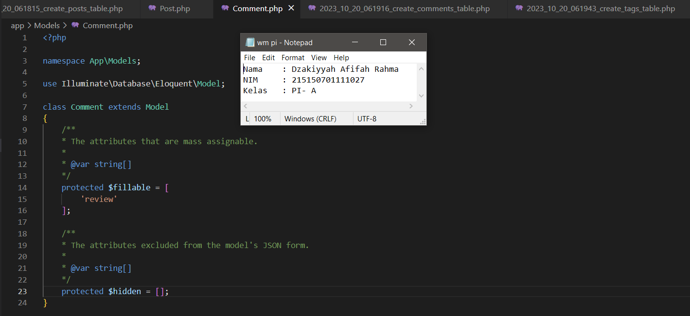 <br>
  
  <tb>3. Buatlah file dengan nama ```Tag.php``` dan isi dengan baris kode berikut<br>
  ```
    <?php
    namespace App\Models;
  
    use Illuminate\Database\Eloquent\Model;
  
    class Tag extends Model
    {
      /**
      * The attributes that are mass assignable.
      *
      * @var string[]
      */
      protected $fillable = [
        'name'
      ];
  
      /**
      * The attributes excluded from the model's JSON form.
      *
      * @var string[]
      */
      protected $hidden = [];
    }
   ```
  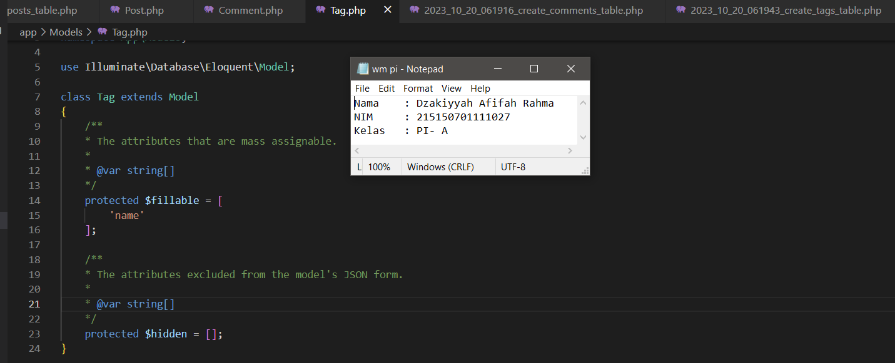 <br>
  
* ## Relasi One-to-Many
  <tb>1. Tambahkan fungsi ```comments()``` pada file ```Post.php```<br>
  ```
    <?php
    namespace App\Models;
  
    use Illuminate\Database\Eloquent\Model;
  
    class Post extends Model
    {
      ...
      // fungsi comments
      public function comments()
      {
        return $this->hasMany(Comment::class, 'postId');
      }
    }
  ```
  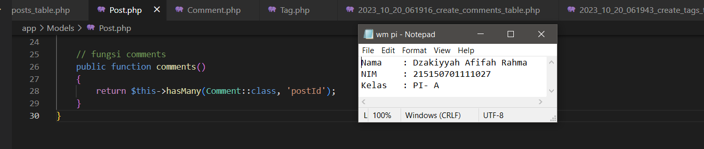 <br>
  
  <tb>2. Tambahkan fungsi ```post()``` dan atribut postId pada ```$fillable``` pada file ```Comment.php```<br>
  ```
    <?php
    namespace App\Models;
  
    use Illuminate\Database\Eloquent\Model;
  
    class Comment extends Model
    {
      ...
  
      protected $fillable = [
        'review',
        'postId' // atribut postId
      ];
  
      /**
      * The attributes excluded from the model's JSON form.
      *
      * @var string[]
      */
      protected $hidden = [];
  
      public function post()
      {
        return $this->belongsTo(Post::class, 'postId');
      }
    }
  ```
  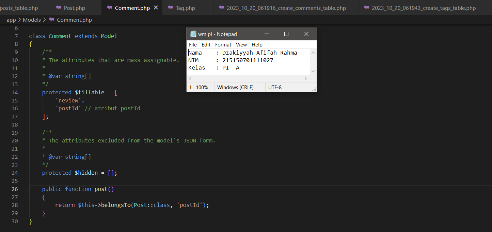 <br>
  
  <tb>3. Buatlah file ```PostController.php``` dan isilah dengan baris kode berikut<br>
  ```
    <?php
    namespace App\Http\Controllers;
  
    use App\Models\Post;
    use Illuminate\Http\Request;

    class PostController extends Controller
    {
      /**
      * Create a new controller instance.
      *
      * @return void
      */
      public function __construct()
      {
        //
      }
  
      //
      public function createPost(Request $request)
      {
        $post = Post::create([
          'content' => $request->content,
        ]);
  
        return response()->json([
          'success' => true,
          'message' => 'New post created',
          'data' => [
            'post' => $post
          ]
        ]);
      }
  
      public function getPostById(Request $request)
      {
        $post = Post::find($request->id);
  
        return response()->json([
          'success' => true,
          'message' => 'All post grabbed',
          'data' => [
            'post' => [
              'id' => $post->id,
              'content' => $post->content,
              'comments' => $post->comments,
            ]
          ]
        ]);
      }
    }
  ```
   <br>
  
  <tb>4. Buatlah file ```CommentController.php``` dan isilah dengan baris kode berikut<br>
  ```
    <?php
  
    namespace App\Http\Controllers;

    use App\Models\Comment;
    use Illuminate\Http\Request;
  
    class CommentController extends Controller
    {
      /**
      * Create a new controller instance.
      *
      * @return void
      */
      public function __construct()
      {
        //
      }
  
      //
      public function createComment(Request $request)
      {
        $comment = Comment::create([
          'review' => $request->review,
          'postId' => $request->postId,
        ]);
  
        return response()->json([
          'success' => true,
          'message' => 'New comment created',
          'data' => [
            'comment' => $comment
          ]
        ]);
      }
    }
  ```
  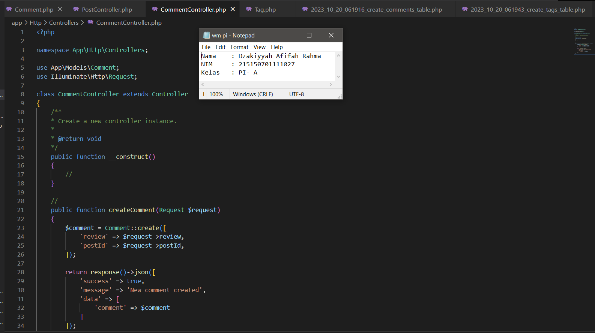 <br>
  
  <tb>5. Tambahkan baris berikut pada ```routes/web.php```<br>
  ```
    <?php
    ...
    $router->group(['prefix' => 'posts'], function () use ($router) {
      $router->post('/', ['uses' => 'PostController@createPost']);
      $router->get('/{id}', ['uses' => 'PostController@getPostById']);
    });
  
    $router->group(['prefix' => 'comments'], function () use ($router) {
      $router->post('/', ['uses' => 'CommentController@createComment']);
    });
  ```
  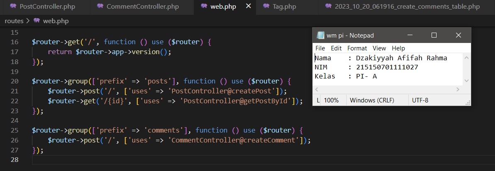 <br>
  
  <tb>6. Buatlah satu post menggunakan Postman<br>
  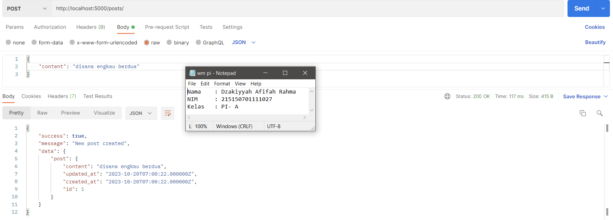 <br>

  ***Hasil pada PHPMyAdmin:***
  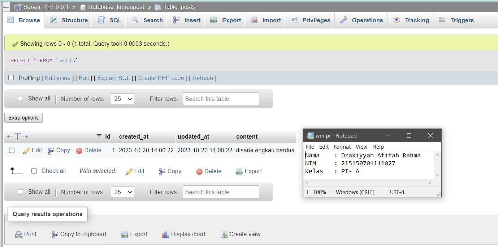 <br>
  
  <tb>7. Buatlah satu comment menggunakan Postman<br>
  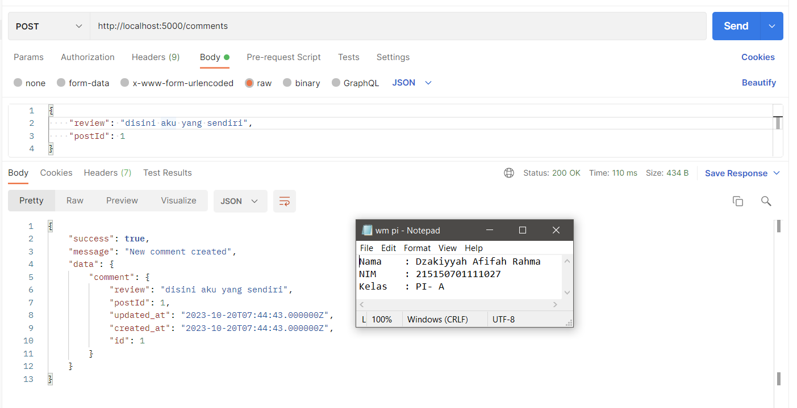 <br>

  ***Hasil pada PHPMyAdmin:***
  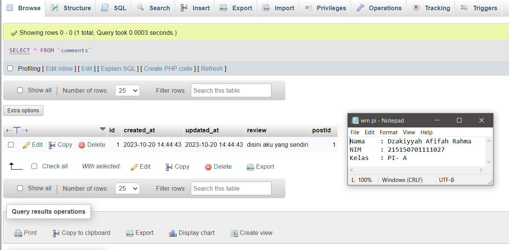 <br>
  
  <tb>8. Tampilkan post menggunakan Postman<br>
  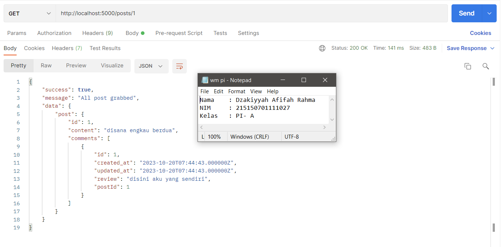 <br>
  
* ## Relasi Many-to-Many
  <tb>1. Tambahkan fungsi ```tags()``` pada file ```Post.php```<br>
  ```
    <?php
    namespace App\Models;
  
    use Illuminate\Database\Eloquent\Model;

    class Post extends Model
    {
      ...
      public function tags()
      {
        return $this->belongsToMany(Tag::class, 'post_tag', 'postId', 'tagId');
      }
    }
  ```
  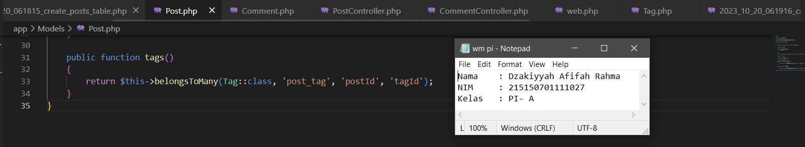 <br>
  
  <tb>2. Tambahkan fungsi ```posts()``` pada file ```Tag.php```<br>
  ```
    <?php
    namespace App\Models;
  
    use Illuminate\Database\Eloquent\Model;
  
    class Tag extends Model
    {
      ...
      public function posts()
      {
        return $this->belongsToMany(Post::class, 'post_tag', 'tagId', 'postId');
      }
    }
  ```
  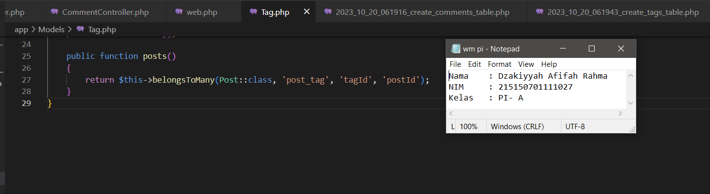 <br>
  
  <tb>3. Buatlah file ```TagController.php``` dan isilah dengan baris kode berikut<br>
  ```
    <?php
    namespace App\Http\Controllers;
  
    use App\Models\Tag;
    use Illuminate\Http\Request;
  
    class TagController extends Controller
    {
      /**
      * Create a new controller instance.
      *
      * @return void
      */
      public function __construct()
      {
        //
      }

      //
      public function createTag(Request $request)
      {
        $tag = Tag::create([
          'name' => $request->name
        ]);
  
        return response()->json([
          'success' => true,
          'message' => 'New tag created',
          'data' => [
            'tag' => $tag
          ]
        ]);
      }
    }
  ```
  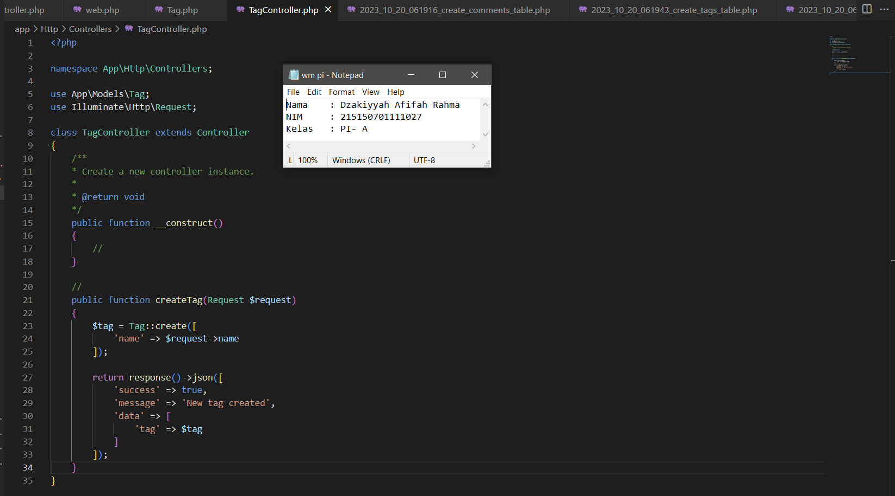 <br>
  
  <tb>4. Tambahkan fungsi ```addTag``` dan response tags pada ```PostController.php```<br>
  ```
    <?php
    namespace App\Http\Controllers;
  
    use App\Models\Post;
    use Illuminate\Http\Request;
  
    class PostController extends Controller
    {
      ...
      public function getPostById(Request $request)
      {
        $post = Post::find($request->id);
  
        return response()->json([
          'success' => true,
          'message' => 'All post grabbed',
          'data' => [
            'post' => [
              'id' => $post->id,
              'content' => $post->content,
              'comments' => $post->comments,
              'tags' => $post->tags, //response tags
            ]
          ]
        ]);
      }

      public function addTag(Request $request)
      {
        $post = Post::find($request->id);
  
        $post->tags()->attach($request->tagId);
  
        return response()->json([
          'success' => true,
          'message' => 'Tag added to post',
        ]);
      }
    }
  ```
   <br>
  
  <tb>5. Tambahkan baris berikut pada ```routes/web.php```<br>
  ```
    $router->group(['prefix' => 'posts'], function () use ($router) {
      $router->post('/', ['uses' => 'PostController@createPost']);
      $router->get('/{id}', ['uses' => 'PostController@getPostById']);
      $router->put('/{id}/tag/{tagId}', ['uses' => 'PostController@addTag']); //
    });
  
    ...
    $router->group(['prefix' => 'tags'], function () use ($router) {
      $router->post('/', ['uses' => 'TagController@createTag']);
    });
  ```
  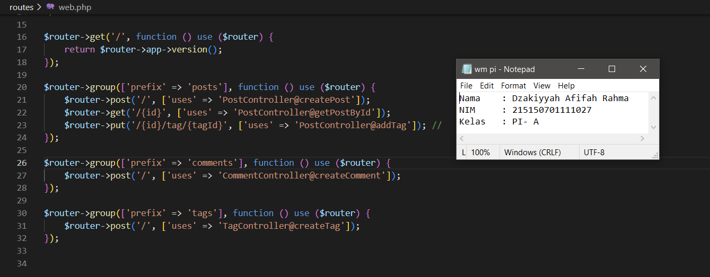 <br>
  
  <tb>6. Buatlah satu tag menggunakan Postman<br>
  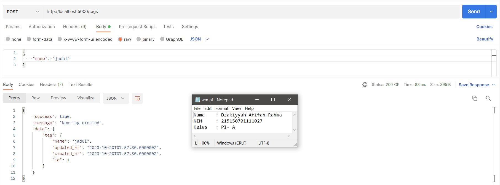 <br>

  ***Hasil di PHPMyAdmin:***
  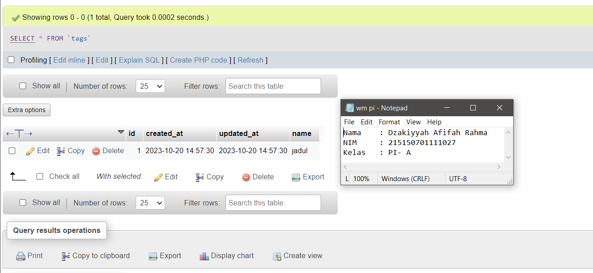 <br>
  
  <tb>7. Tambahkan tag **“jadul”** pada post **“disana engkau berdua”** <br>
  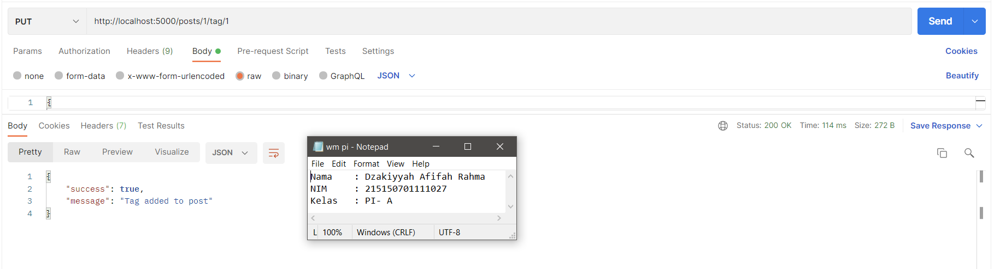 <br>
  
  <tb>8. Tampilkan post **“disana engkau berdua”** menggunakan Postman<br>
  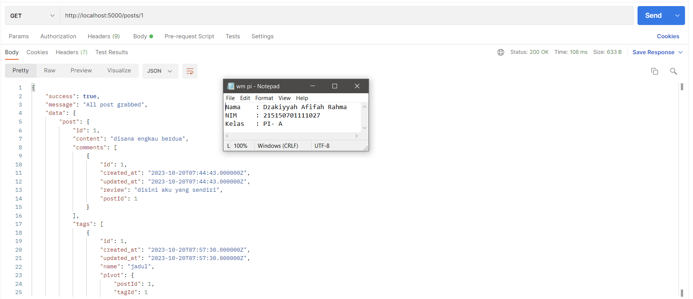 <br>
  
  <tb>9. Buatlah postingan **“tanpamu apa artinya”** menggunakan Postman<br>
  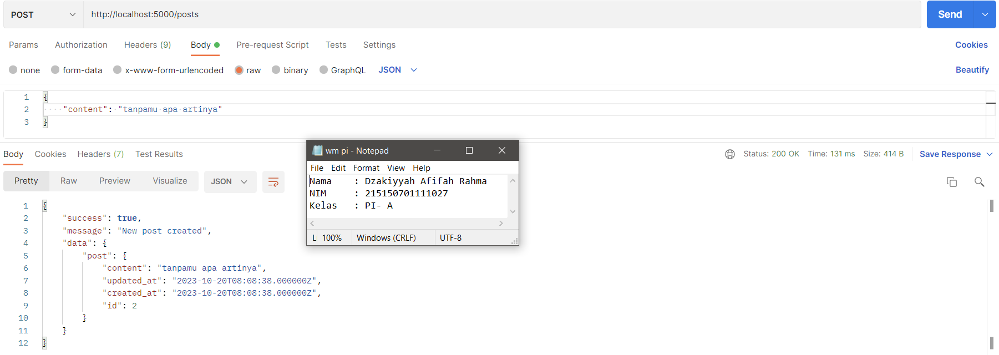 <br>
  
  <tb>10. Tambahkan tag **“jadul”** pada postingan **“tanpamu apa artinya”** <br>
  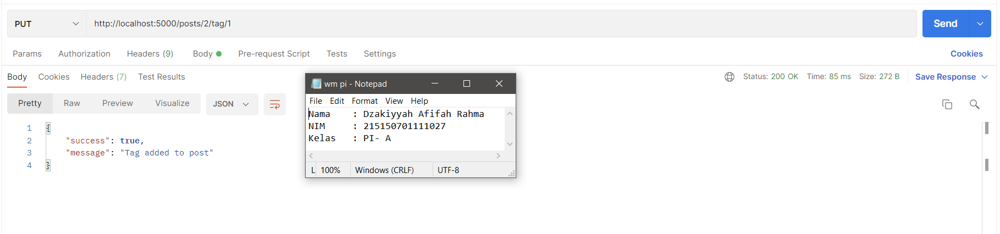 <br>
  
  <tb>11. Buatlah tag **“lagu”** menggunakan Postman<br>
  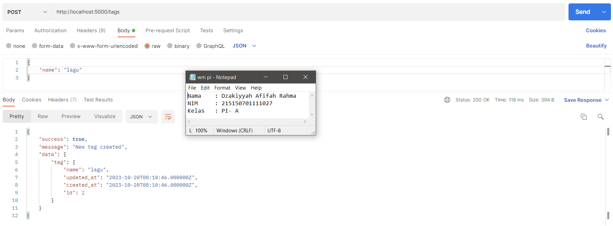 <br>
  
  <tb>12. Tambahkan tag **“lagu”** pada postingan **“tanpamu apa artinya”** <br>
  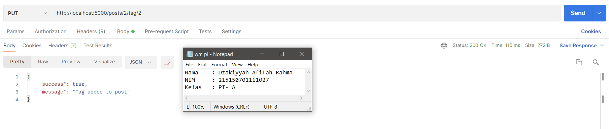 <br>
  
  <tb>13. Tampilkan post pertama<br>
  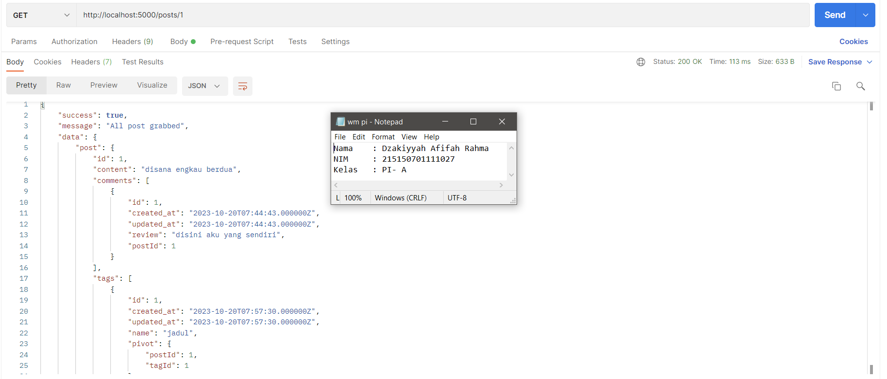 <br>
  
  <tb>14. Tampilkan post kedua<br>
  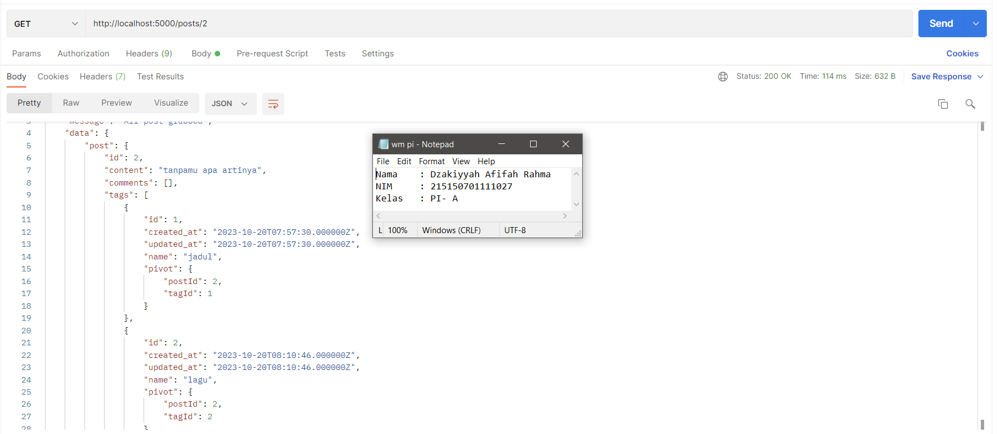 <br>
  
  > [!NOTE]
  > Tag "jadul" yang berada pada dua post menunjukkan **satu** tag dapat berada di **banyak** post

  > [!NOTE]
  > Post "tanpamu apa artinya" yang memiliki dua tag menunjukkan **satu** post dapat memiliki banyak **tag**
